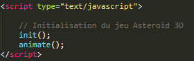
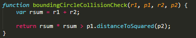
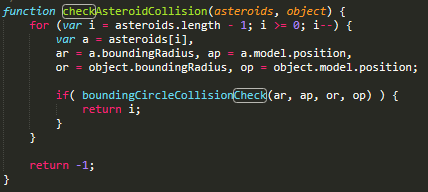
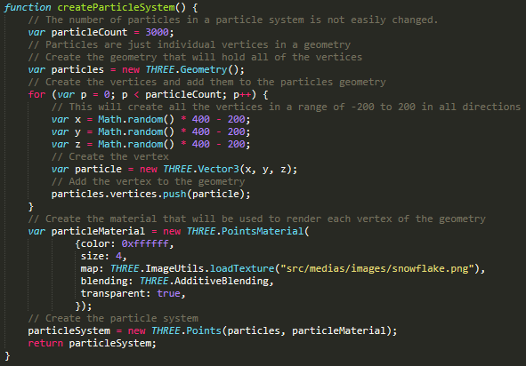
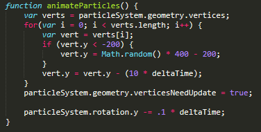
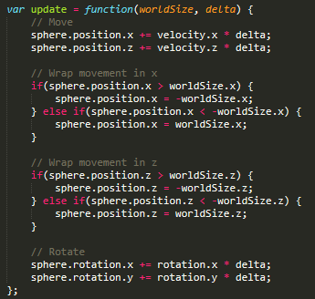
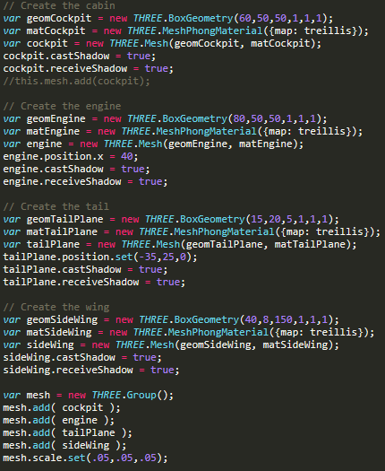
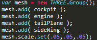

#ASTEROID 3D
##[JOUEZ LE JEU](../asteroid_3D.html)

-

Réalisation d'un clone du jeu [Asteroids](http://www.dougmcinnes.com/html-5-asteroids) en 3D basé sur WebGL.

Développé par Gnebehi Bagre Jean-Philippe , Master 1 TI

Encadré par [Bruno Jobard](http://bjobard.perso.univ-pau.fr/), Maître de Conférences à UPPA.

===

##Introduction

Dans le cadre de notre formation en Master 1 Technlogie Internet,  
il nous à été demandé dans le module Synthèse d'image avancé 
la réalisation d'un clone du jeu  Asteroids en 3D basé sur la technologie WebGl.

Ce rapport a donc pour but d'expliquer les différentes phases de développment du jeu.

Asteroids est un jeu vidéo de type shoot 'em up édité par Atari Inc.   
En 1979 sur borne d'arcade. Le jeu a connu un important succès aux États-Unis et au Japon, et demeure considéré comme un classique de l'histoire du jeu vidéo. Le jeu est proposé sur Xbox 360 (via le Xbox Live Arcade) depuis novembre 2007 sous le titre Asteroids & Deluxe.

===

##I- BIBLIOTHEQUES JAVASCRIPTS

-

####I-1 BIBLIOTHEQUES POUR LE JEU

- [three.js](https://cdnjs.cloudflare.com/ajax/libs/three.js/102/three.js)

Bibliothèque pour créer et afficher des graphiques informatiques 3D

- [THREEx.FullScreen.js](https://cdnjs.cloudflare.com/ajax/libs/three.js/102/three.js)

Assistant THREEx facilite la gestion de l'API plein écran

- [stats.min.js](https://cdnjs.cloudflare.com/ajax/libs/three.js/102/three.js)

Analyseur de performances JavaScript

- [keydrown.js](https://cdnjs.cloudflare.com/ajax/libs/three.js/102/three.js)

Keydrown est une bibliothèque permettant de gérer l'état du clavier

- [jquery-2.0.0.js](https://cdnjs.cloudflare.com/ajax/libs/three.js/102/three.js)

Simplifie l’utilisation de ce même langage dans les pages Web

-

####I-2 BIBLIOTHEQUES POUR LE RAPPORT

[Reveal.js](https://revealjs.com/#/) The HTML Presentation Framework

Il s'agit d'un framework pour créer facilement de belles présentations en HTML.

Vous aurez besoin d'un navigateur prenant en charge les transformations CSS 3D,

Pour le voir dans toute sa splendeur.

===

##II- ARCHITECTURE

- Le fichier [game.js](../src/js/game.js) est la classe motrice du programme. Tous les modèles y sont instanciés. Il contient les fonctions init() et animate().

Initialisation du jeu Asteroid dans asteroid3D.html

- Le fichier [asteroid.js](../src/js/asteroid.js) est le fichier de création d'un modèle asteroid (sa vitesse , rotation) et contient les fonctions utilles à son interaction avec d'autres objets. Nous avons opté pour notre modèle une figure géométriqe: l'octahedron.

-

- Le fichier [bullet.js](../src/js/bullet.js) est le fichier de création d'un modèle sphérique qui sera plus tard associé au vaisseau spacial du joueur.

- Le fichier [flash.js](../src/js/flash.js) reprend exactement le modèle asteroid, la seule différence est qu'il sera utilisé pour permettre au joueur lors d'une collison de gagner des points eclair qui lui permettront de détruire des astéroids différement.

- Le fichier [helpers.js](../src/js/helpers.js) contient des fonctions mathématique importante pour le déplacement selon des valeur "random" mais sur le cercle de contôle de collison.

- Le fichier [keyboard.js](../src/js/keyboard.js) permet la gestion des états du clavier et utilise la bibliothèque keydrown.js.

-

- Le fichier [key.js](../src/js/key.js) permet la gestion des états du clavier classiquement. En effet au cours du dévéloppment nous nous sommes rendu compte que cette méthode était plus longue d'où l'idée d'utiliser une bibliothèque plus simple.

- Le fichier [player.js](../src/js/player.js) est associé au modèle sphérique du fichier bullet.js et est lui même un modèle de vaisseau spacial que nous avons implémenté nous même.

- Le fichier [vie.js](../src/js/vie.js) consitue trois cylindre qui sont considéré comme les 3 vies du joueur.

===

##III- MECANISME DU JEU

-

####III-1 L'IDEE DU JEU

Le but est de survivre le plus longtemps possible en détruisant les astéroïdes pour engranger les points.
L'aire de jeu est intégralement représenté à l'écran.

Grâce à un effet de wraparound, lorsqu'un élément sort du cadre de l'écran, il réapparaît du côté opposé (idem pour le vaisseau du joueur).

-

####III-2 LE JOUEUR 

Le joueur lance des bombes pour détruire les astéroides.
Lorsqu'un astéroïde est touché par un tir, il se divise en deux blocs de taille moyenne,
lesquels peuvent à leur tour être divisés en deux plus petits blocs, lesquels peuvent enfin être détruits. Le programme original ne peut cependant afficher que 26 astéroïdes simultanément à l'écran.

Une fois tous les astéroïdes détruits, le joueur passe au niveau suivant : le nombre d'astéroïdes présent au début du niveau varie en augmentant.
Le nombre de points rapportés par la destruction d'un élément est dépendante de sa taille.

===

##IV- GESTION DES EVENEMENTS 

-

###IV-1 LES COLLISION

-D'abord on crée la fonction qui retourne cercle minimum de collison.

Cercle de collision

-

-Dans le cas d'une vérification de collision entre un asteroid et le joueur,on vérifie les collisions de tout objet contre tous les astroïdes actuels.
Puis on renvoi l'index de l'astéroïde en collision et -1 s'il n'y a pas de collision.

Vérification de collision

===

##V- GRAPHISME

-

####V-1 LE FOND ETOILE

- Le nombre de particules ici est de 3000.
Les particules ne sont que des sommets individuels dans une géométrie.
On Crée la géométrie qui contiendra tous les sommets dans une plage de -200 à 200 dans toute les directions. 
Ensuite on crée le matériau qui sera utilisé. Il s'agit ici d'une image.

-

Creation de particules

-
Enfin on anime ces particules

Animation de particules

-

####V-2 LES ASTEROIDS
-Les asteroids sont des Octahedrons qui ont une vitesse et une rotation. Il se déplace selon une fonction random et dans un cadre spécifique(worlsize) , ce déplacement étant très important.

Déplacement des Asteroids

-

####V-3 LE VAISSEAU

-Il s’agit de combiner et d’encapsuler des formes.
Puis le vaiseau sera instancié et ajouté à la scène.

Création des formes

-

On regroupe toutes ces formes créee.

Groupement des formes

===

##VI- FONCTIONALITES

La fonction [checkKeyboard()](../src/js/keyboard.js) contient les fonctions screenshot avec P ,fullscreen avec F,l'aide avec H , K pour tuer tous les astéroides,
L'invincibilité avec I.

Pour la touche 2 elle a été implentée dans player [player.js](../src/js/player.js): On met la vitesse à nulle.

Pour la touche J elle a été implentée dans player [game.js](../src/js/game.js): Si le joue capte 5 eclair il peut casser des astéroides sans tirer avec cette touche.

Pour la touche I elle a été implentée dans [game.js](../src/js/game.js)

Seul les touches 0 et 1 n'ont pas pu être implémentée.

===

##CONCLUSION

En conclusion , c'est une première pour nous de travailler sur un projet qui requiert un rendu 3D
en utilisant des bibliothèques graphiques écrites en Javascript.
En général, nous avons consolidé nos connaissances générales et appris à faire
des applications plus attrayantes et plus orientées pour le monde du travail.
Nous sommes globalement satisfait de ce que nous avons réalisé.
Au niveau de la gestion du projet, nous avons réussi à bien répartir les
tâches dans le temps afin de réaliser nos objectifs. 

===

##CONTACTS

[Profil GitHub](https://github.com/mamssoGassama)

[Profil Linkedin](https://www.linkedin.com/in/jean-philippe-gnebehi-317a48116/)